# IR Final Project - NYTimes Search Engine

## Introduction

This is the final project for Information Storage & Retrieval course, and our goal is to build our news search engine for The New York Times, which supports spell check, autocomplete and can display highlighted snippets.

## Team

- Zechen Wang
- Danlan Huang
- Weihan Chen

## Timeline

- Start Date: 2019/09/22
- Last Update: 2019/12/12

## Data

We crawled the news data between 2017 to 2019 from NYTimes, and we extracted the links which are related to NYTimes in the news articles we crawled, and crawled those links too.

The final data size is 1.34G.

The data we crawled are stored in the format:

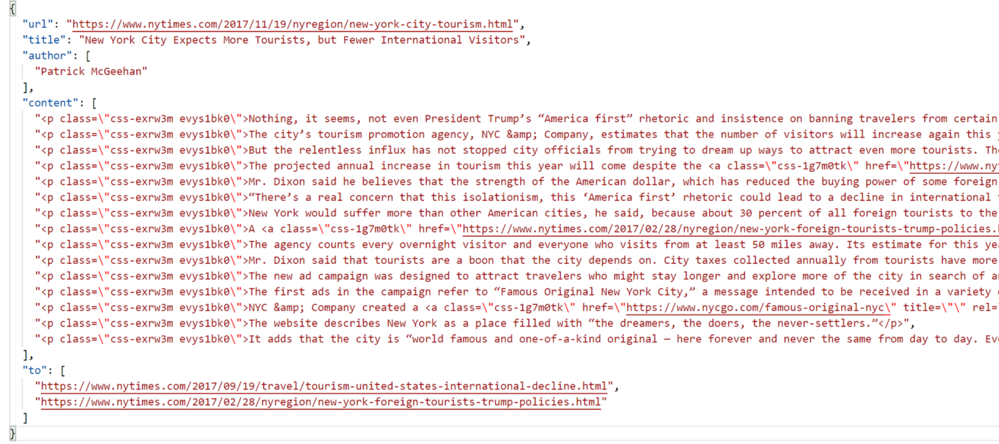

And after reformatting (remove html tags and add unique docIDs):

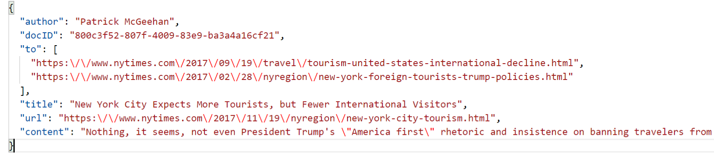

## Flask RESTful API

Check if a token is in vocabulary:

1 = in the vocabulary, 0 = not in the vocabulary

Calculate similarity between words:

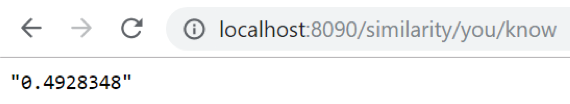

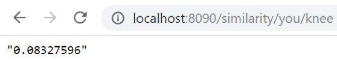

It returns the similarity in string format.

## Demo

Search bar:

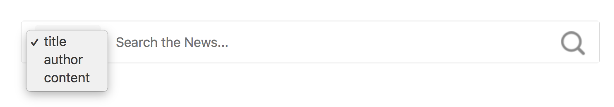

Search results:

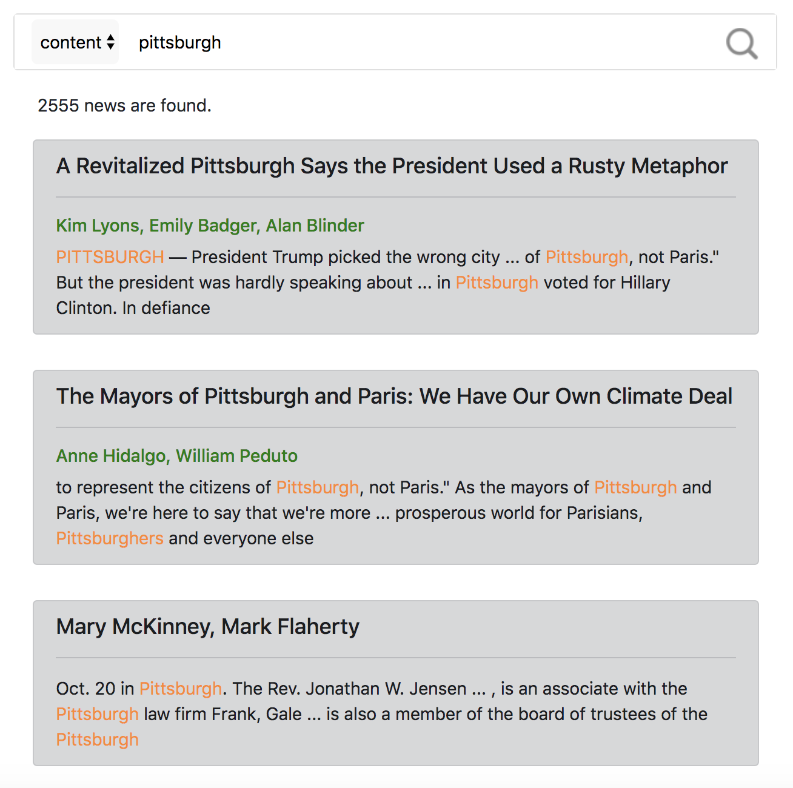

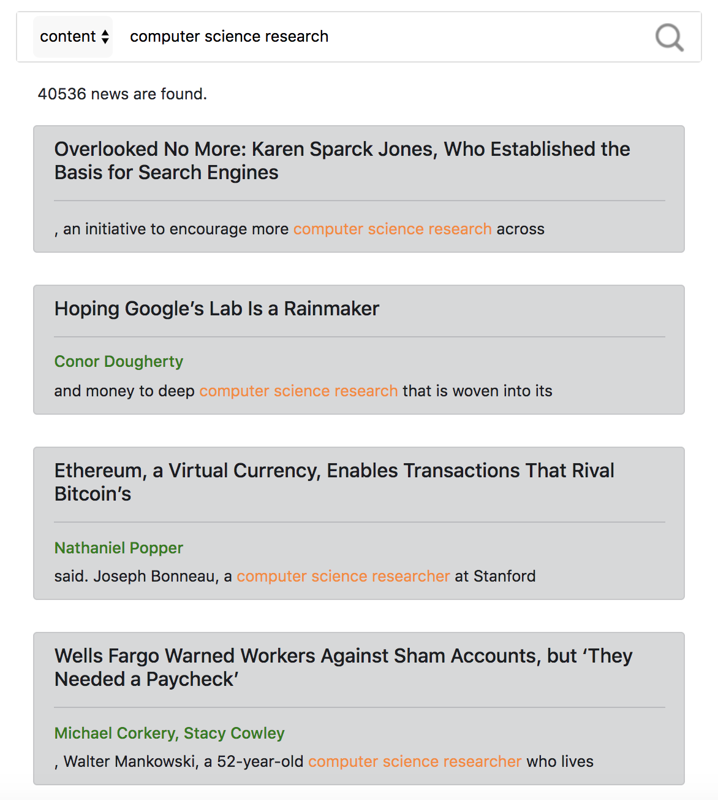

Pagination:

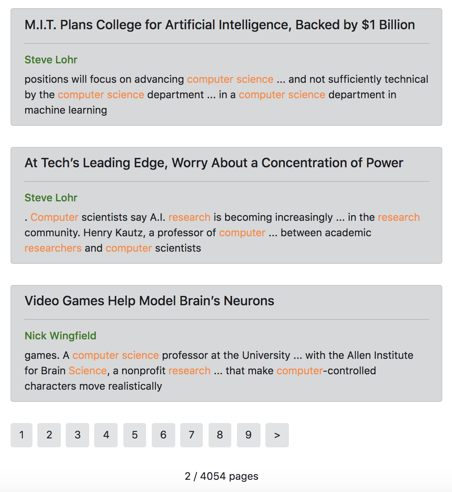

Spell check:

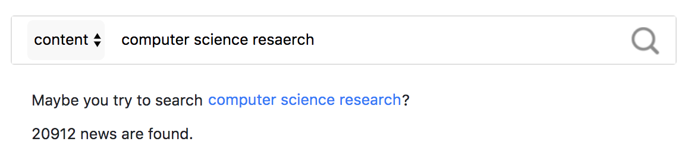

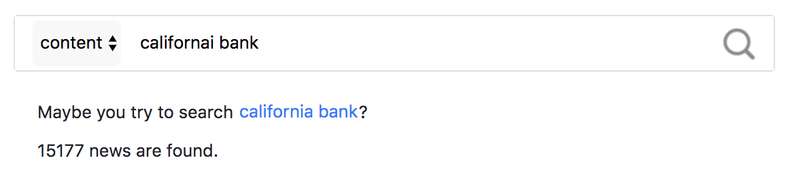

Autocomplete:

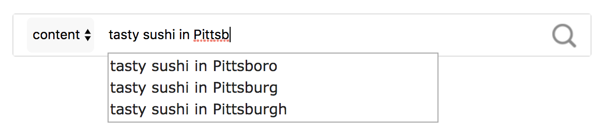

